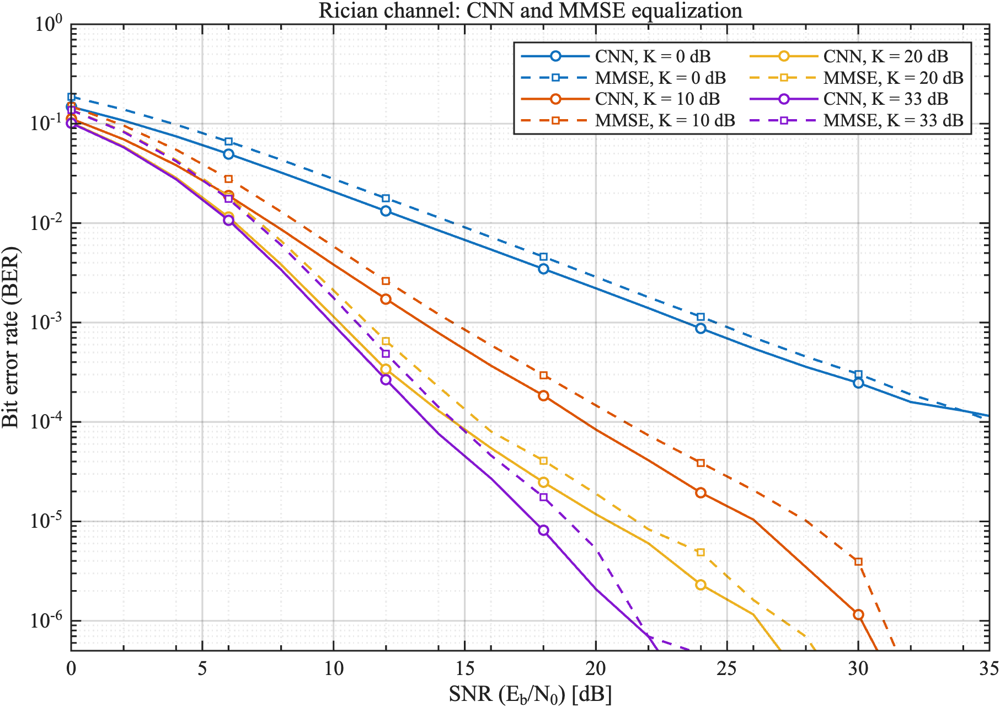

# NeuralOFDM: CNN-Assisted IEEE 802.11a Receiver

NeuralOFDM is a MATLAB R2026a research project that implements, trains, and benchmarks a CNN-assisted OFDM receiver inspired by the IEEE 802.11a physical layer. The system evaluates a learned frame-aware detector against a conventional MMSE equalizer over Rician multipath channels, using the same received frames for both methods to keep the comparison reproducible.

This project was developed as part of my degree thesis in Computer, Electronic and Telecommunications Engineering.

## What It Does

- Builds IEEE 802.11a-like legacy OFDM frames with L-STF, L-LTF, 64-point FFT, 16-sample cyclic prefix, 48 QPSK payload carriers, and 4 pilot carriers.
- Simulates LOS/Rician multipath propagation with configurable SNR, K-factor, Doppler shift, path delays, and average path gains.
- Extracts pilot-aware CNN features from the received OFDM grid, including raw I/Q, equalized I/Q, L-LTF channel estimates, channel magnitude, pilot masks, active-carrier masks, and normalized carrier position.
- Trains a residual 1-D convolutional network to classify QPSK payload symbols across OFDM subcarriers.
- Benchmarks CNN and MMSE detection with Monte Carlo BER curves, synchronized random seeds, timestamped charts, and Base64-encoded JSON logs.

## Final Performance Snapshot

The latest benchmark run is `20260622_103836_412`, evaluated with checkpoint `ckpt_p04_20260612_060306.mat`. The published chart from that run was renamed to `CHARTS/performance_test.png`.



### Benchmark Configuration

| Parameter | Value |
|:---|:---|
| Channel profile | Rician LOS multipath |
| SNR definition | `E_b/N_0` |
| SNR grid | `0:2:36 dB` |
| Rician K-factors | `0, 10, 20, 33 dB` |
| Path delays | `[0, 30 ns]` |
| Average path gains | `[0, -10] dB` |
| Doppler shift | `0 Hz` |
| Monte Carlo budget | 600-900 frames per point |
| Stop condition | Minimum 600 frames and 400 bit errors for both methods |
| CNN inference batch | 4 frames |
| Random seed | `352` |

### BER Thresholds

| Rician K | CNN first SNR <= 1e-3 | MMSE first SNR <= 1e-3 | CNN first SNR <= 1e-4 | MMSE first SNR <= 1e-4 |
|---:|---:|---:|---:|---:|
| 0 dB | 24 dB | 26 dB | not reached | 36 dB |
| 10 dB | 14 dB | 16 dB | 20 dB | 22 dB |
| 20 dB | 12 dB | 12 dB | 16 dB | 16 dB |
| 33 dB | 10 dB | 12 dB | 14 dB | 16 dB |

### Selected BER Points

| Rician K | Method | BER @ 12 dB | BER @ 20 dB | BER @ 30 dB | BER @ 36 dB |
|---:|:---|---:|---:|---:|---:|
| 0 dB | CNN | 1.32e-2 | 2.21e-3 | 2.47e-4 | 1.02e-4 |
| 0 dB | MMSE | 1.78e-2 | 2.87e-3 | 3.04e-4 | 8.22e-5 |
| 10 dB | CNN | 1.72e-3 | 8.38e-5 | 1.16e-6 | 0 |
| 10 dB | MMSE | 2.62e-3 | 1.47e-4 | 3.94e-6 | 0 |
| 20 dB | CNN | 3.39e-4 | 1.18e-5 | 0 | 0 |
| 20 dB | MMSE | 6.52e-4 | 1.90e-5 | 0 | 0 |
| 33 dB | CNN | 2.67e-4 | 2.08e-6 | 0 | 0 |
| 33 dB | MMSE | 4.87e-4 | 5.32e-6 | 0 | 0 |

At high K-factors, the CNN generally reaches low-BER operating regions earlier than MMSE. For example, at K = 33 dB the CNN reaches BER <= 1e-4 at 14 dB, while MMSE reaches the same threshold at 16 dB. At K = 0 dB, the two curves are close and MMSE is slightly better at the final 36 dB point.

Zero-error entries are raw empirical BER values over the processed bits. In the plotted curve, zero-error points use the standard visualization convention `0.5 / processed_bits`.

### Final High-SNR Point

| Rician K | Frames @ 36 dB | Bits @ 36 dB | CNN errors | CNN BER | MMSE errors | MMSE BER |
|---:|---:|---:|---:|---:|---:|---:|
| 0 dB | 900 | 4,320,000 | 440 | 1.02e-4 | 355 | 8.22e-5 |
| 10 dB | 900 | 4,320,000 | 0 | 0 | 0 | 0 |
| 20 dB | 900 | 4,320,000 | 0 | 0 | 0 | 0 |
| 33 dB | 900 | 4,320,000 | 0 | 0 | 0 | 0 |

## Project Structure

```text
CNN_V5/
|-- trainer.m                 # Training entry point
|-- tester.m                  # BER benchmark entry point
|-- src/
|   |-- phy/                  # OFDM frame, channel, and simulation parameters
|   |-- model/                # CNN architecture, feature extraction, checkpoints
|   |-- training/             # Frame-aware CNN training routines
|   |-- evaluation/           # Monte Carlo BER benchmarks
|   |-- visualization/        # BER plotting utilities
|   `-- utils/                # Project paths and Base64 log writer
|-- tests/                    # End-to-end smoke test
|-- CHECKPOINTS/              # Local model checkpoints
|-- CHARTS/                   # BER charts, including performance_test.png
`-- LOGS/                     # Base64 JSON benchmark logs
```

## Key Files and Functions

- `trainer.m` starts the main training pipeline and adds `src/` to the MATLAB path.
- `tester.m` runs the default CNN-vs-MMSE Rician multi-K benchmark and writes the chart/log outputs.
- `src/phy/simulation_parameters.m` centralizes OFDM, modulation, pilot, channel, and derived physical-layer parameters.
- `src/phy/IEEE80211aFrame.m` builds and receives the IEEE 802.11a-like frame structure.
- `src/phy/multipath_channel.m` applies the configured multipath propagation model.
- `src/model/LOS_CNN.m` defines the residual 1-D CNN, class encoding, BER utilities, and training loss.
- `src/model/build_frame_cnn_batch.m` and `src/model/build_ofdm_cnn_features.m` transform received frames into CNN-ready feature tensors.
- `src/model/load_cnn_checkpoint.m` validates and loads compatible `dlnetwork` checkpoints.
- `src/training/train_frame_cnn.m` performs frame-aware training over randomized LOS/Rician channel conditions.
- `src/evaluation/run_rician_k_benchmark.m` performs the final Monte Carlo benchmark over SNR and Rician K-factor grids.
- `src/visualization/plot_rician_k_ber.m` generates the IEEE-style BER vs SNR chart.

## Training Overview

The CNN is trained directly on dynamically generated OFDM frames rather than on a static dataset. Each training batch is sampled from randomized LOS/Rician conditions, including SNR variation, K-factor variation, carrier phase augmentation, and different multipath delay profiles.

The default training setup uses:

| Parameter | Default |
|:---|:---|
| Iterations | 400 |
| Mini-batch size | 256 |
| Initial learning rate | `8e-4` |
| Learning-rate schedule | Exponential decay |
| SNR range | `[0, 35] dB` |
| K-factor range | `[8, 100]` linear |
| Validation points | `10, 15, 20 dB` |
| Validation scenario | LOS, K = 15 |

The network architecture is a carrier-wise residual 1-D CNN with a 10-channel input, five dilated residual blocks, and a QPSK class-probability output for each OFDM carrier. Checkpoints are saved as `.mat` files in `CHECKPOINTS/`.

## Running on MATLAB R2026a

### Requirements

- MATLAB R2026a
- Communications Toolbox
- Deep Learning Toolbox

The current configuration is CPU-oriented and does not require a GPU.

### Quick Start

Open MATLAB R2026a, move to the project root, and run:

```matlab
cd('/path/to/CNN_V5')
modelPath = trainer;
results = tester;
```

To run the benchmark with an existing local compatible checkpoint:

```matlab
cd('/path/to/CNN_V5')
results = tester('ModelPath', 'CHECKPOINTS/ckpt_p04_20260612_060306.mat');
```

The benchmark writes:

- a MATLAB `results` structure in the workspace;
- a timestamped BER chart in `CHARTS/`;
- a Base64-encoded JSON log in `LOGS/`.

### Faster Smoke Run

Use a reduced Monte Carlo budget when you only need to verify the pipeline:

```matlab
results = tester( ...
    'SNRdB', 0:6:36, ...
    'MinFrames', 20, ...
    'MaxFrames', 40, ...
    'TargetBitErrors', 50, ...
    'Visible', false);
```

### Tests

```matlab
runtests('tests/test_frame_pipeline.m')
```

The smoke test validates frame generation, synchronization, CNN feature construction, and a high-SNR equalization sanity check.

## Research Scope

This repository is a research and thesis-oriented simulation project. It is not intended to be a complete interoperable IEEE 802.11a transceiver implementation.
